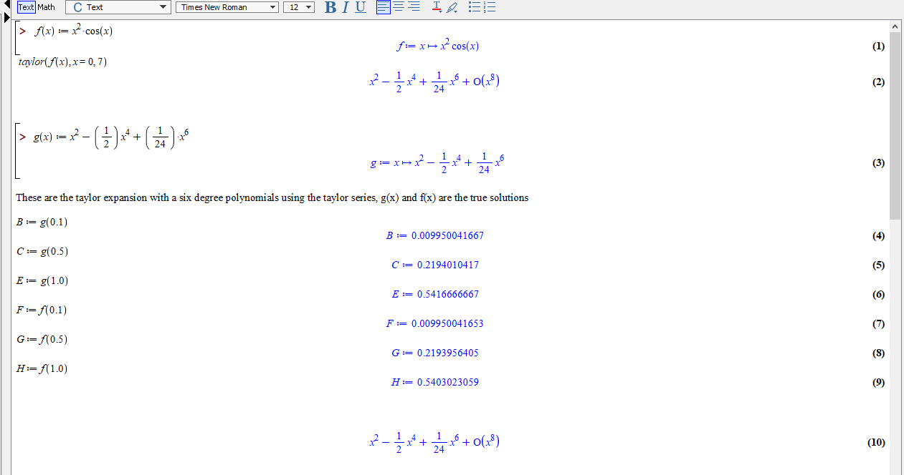
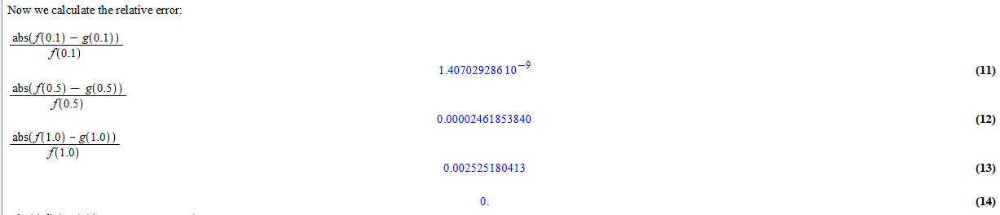
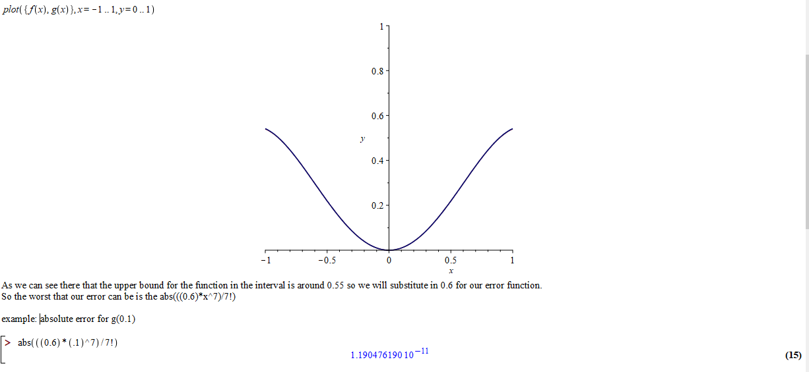
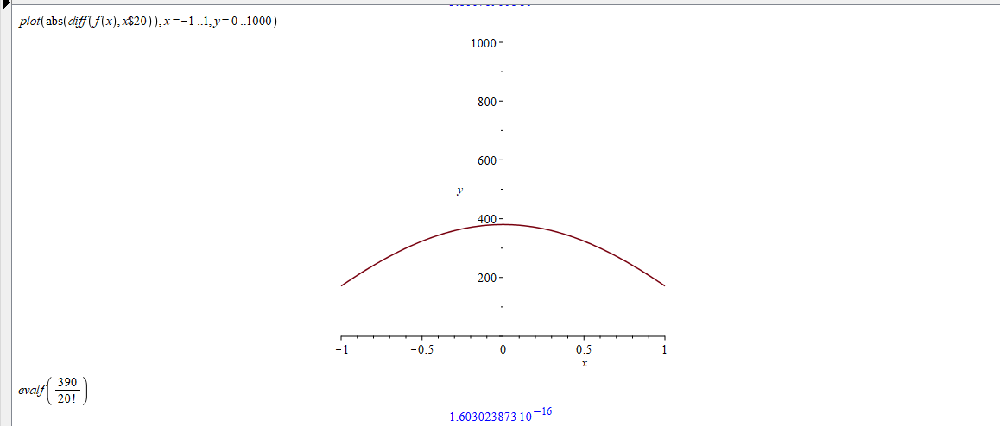
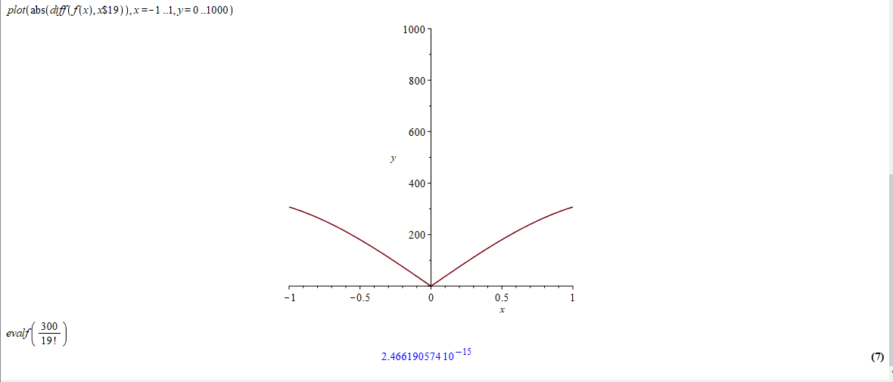
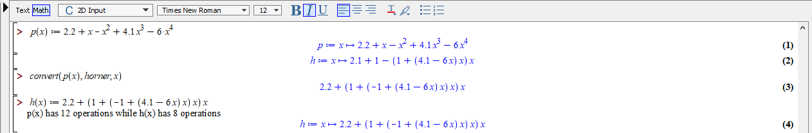
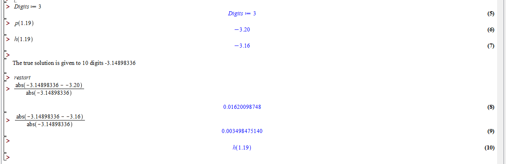
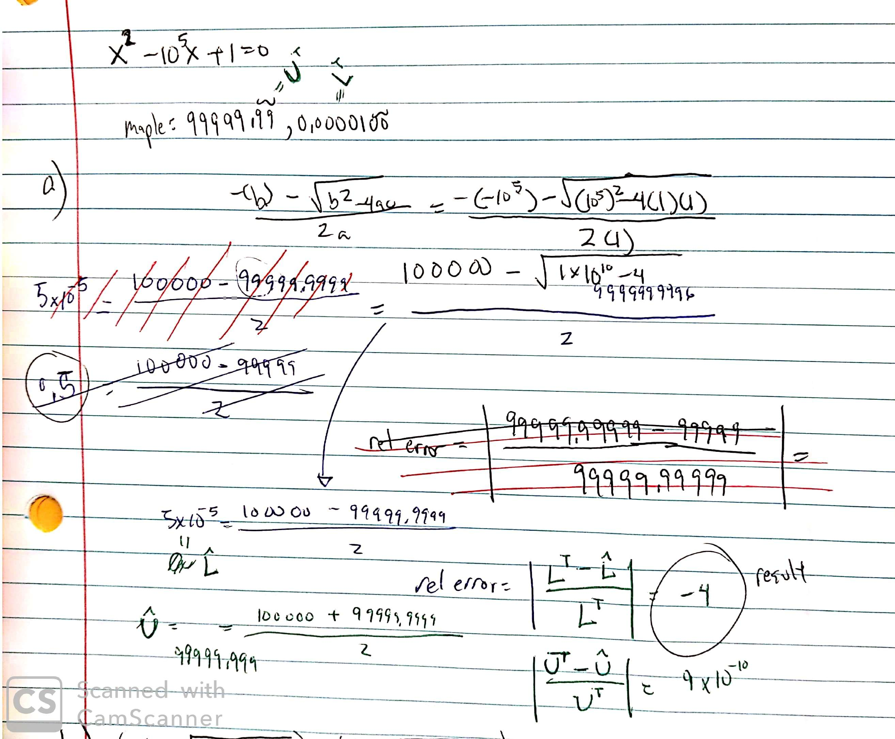
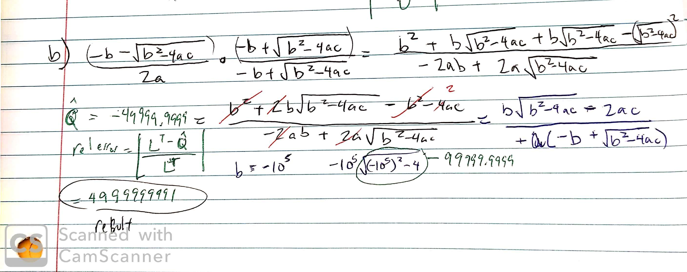
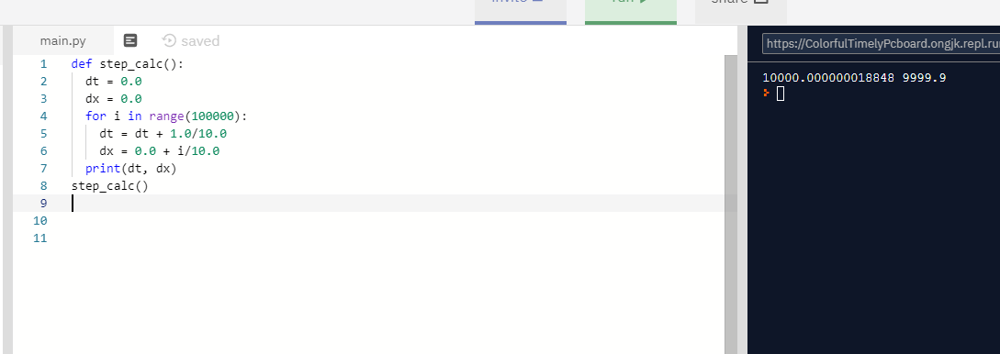

```{r setup, include=FALSE}
knitr::opts_chunk$set(echo = TRUE)
```

The goal for this assignment is to be sure you understand the concepts from Chapter 1. Read all sections
of Chapter 1. Be sure to read the guidelines for capstone assignments in the “Course Preliminaries” block
in ASULearn! The final write-up is due on February 10 via ASULearn upload as ONE pdf.


## 1. 

Consider the Taylor polynomial for $f(x) = x^2cos(x)$ centered at $x = 0$. Suppose we want to use the
Taylor polynomial as an approximation for the function on the interval $[-1,1]$.


(a) Generate the sixth degree polynomial $T(x)$, and find $T(0.1)$, $T(0.5)$, and $T(1.0)$.





(b) What is the relative error in the values found in (a)?





(c) The magnitude of the error for this polynomial approximation can be written as $$  \displaystyle \bigg| \frac{f^{(7)}(\xi)}{7!}x^7 \bigg| $$. Find an upper bound on the error predicted by the Taylor series error term over the interval [-1,1]? (Hint:  Graph the derivative in the interval to find an upper bound; then find an upper bound for $x^7$ in the interval.)





I used 0.1 as an example of what this error might look for the x = 0.1 case. I found that the highest y takes for the six degree polynomial is 0.6.

(d) Experiment with the error term to determine how many terms are needed to compute $f(x)$ accurately for double precision use ($10^{-16}$) on this interval. 





I found that about 20 terms will allow us to have the double precision accuracy.




We can see that 19 terms is just a bit short of the double precision accuracy.


## 2. 

Using the condition number formula from class: 

$$ \displaystyle \bigg| \frac{xf'(x)}{f(x)} \bigg|$$


(a) Verify that multiplication is well-conditioned by examining the function $f(x) = a \cdot x$.

* $f(x) = a \cdot x$

* $f'(x) = a$

$$  \displaystyle \bigg| \frac{xf'(x)}{f(x)} \bigg| =  \displaystyle \bigg| \frac{xa}{xa} \bigg| = 1$$

This shows that its well conditioned as $1$ does not magnify the relative error.


(b) Verify that the exponential function is well-conditioned provided $x$ is not too large by examining $f(x) = e^{ax}$. How big is the condition number for $x = 10^5$, and what does that say about the number of digits lost when calculating $e^{12345}$?

* $f(x) = e^{ax}$

* $f'(x) = ae^{ax}$

$$  \displaystyle \bigg| \frac{xf'(x)}{f(x)} \bigg| =  \displaystyle \bigg| \frac{xae^{ax}}{e^{ax}} \bigg| = xa$$
This shows that the term is only as well conditioned as $xa$. However once $xa$ gets larger, the worst it gets. For example with $x = 10^5$

$$  \displaystyle \bigg| \frac{xf'(x)}{f(x)} \bigg| =  \displaystyle \bigg| \frac{10^5ae^{a10^5}}{e^{a10^5}} \bigg| = 10^5a$$ 
shows that the condition is $10^5a$ depending on how large or small $a$ will determine how well-condition this is.

For a particular number such as $e^{12345}$, it would have a condition number of $12345$ multiplied by the relative error of the computer.

(c) Given the subtraction $x-2$, how close can $x$ be to 2 if we want to lose no more than 2 digits accuracy (i.e., if the condition number should be no larger than $10^2$)?

* $f(x) = x - 2$

* $f'(x) = 1$

$$  \displaystyle \bigg| \frac{xf'(x)}{f(x)} \bigg| =  \displaystyle \bigg| \frac{x*1}{x - 2} \bigg| = \displaystyle \bigg| \frac{x}{x - 2} \bigg| \leq 10^2$$ 
I went ahead and just solve for x here, dropping the absolute values and inequality, $ \frac{x}{x - 2} = 100$ which led to me $x = 100(x-2)$, then $x = 100x - 200$. We then move over the $x$, $x - 100x = - 200$ and finally $x = 200/99$ to be roughly around $2.0202$ if we want to lose no more than 2 digits accuracy.

## 3. 

Sections 1 and 2 in the text discuss some ways in which we can potentially reduce rounding error by
performing some algebraic changes to calculations. One of the techniques, which involves factoring,
is “Horner’s” method.


(a) Hornerize $ p(x) =  2.2+ x- x^2 + 4.1x^3 - 6x^4$ and count the number of basic operations in the two algebraically equivalent versions -- assume powers are calculated as repeated multiplication, e.g., $x^3 = x \cdot x \cdot x$.  




(b)  Calculate $p(1.19)$ using each version saving 3 significant digits after EVERY operation and find the relative error in each (the true solution to 10 decimal places is: -3.14898336).




## 4. 

We talked in class about cancellation error, aka bad subtractions.  Let's see what happens when we try to solve $x^2 - 10^5 x + 1 = 0$. Note that to 15 digit accuracy, Maple gives the roots as: 99999.9999900000, 0.000010000000000.


(a) Using the quadratic formula, one of the roots can be calculated as $\displaystyle \frac{-b - \sqrt{b^2 - 4ac}}{2a}$. Notice the subtraction in the numerator, because $b < 0$. Carry out the calculation by hand rounding to 4 significant digits after EVERY operation. What answer do you get? What is the relative error?




(b) Build the algebraically equivalent version of this formula by multiplying by 
	$\displaystyle \frac{-b + \sqrt{b^2 - 4ac}}{ -b + \sqrt{b^2 - 4ac}}$ and then simplifying. What results from this formula using 4 digit calculations? What is the relative error in this solution?
	



	
## 5. 

Create a Python program for the following pseudocode. Explain what the mathematical result of
this code should be, and why the computational result appears to be different. Note that this “issue” is a simplified version of problems with clocks and missile launching during the first Gulf War.

```{r}
# program step_calc()
#      dt = 0.0
#      dx = 0.0
#      for i from 1 to 100000 do
#             dt = dt + 1.0/10.0
#             dx = 0.0 + i/10.0
#      end for
#      output dt and dx
# end step_calc
```

repl.it link: https://repl.it/@ongjk/ColorfulTimelyPcboard



As the for loop is going it should start at 0 and stop 1 short of 100000 because it starts at 0. With each iteration dt should be increasing by 1/10 so it should eventually end up at 10000. The added .000000018848 is some sort of computational error. The dx on the otherhand does not update but rather replace after each iteration and here just divides the last i by 10. This results in 9999.9 since it stops short of 100000. If I were to change the range to go from (1, 100001) then it would result in a clean 10000. 


